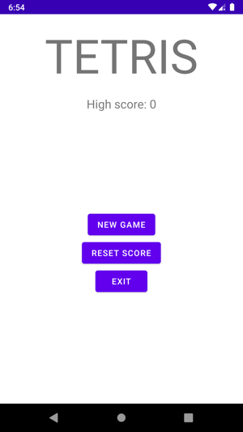
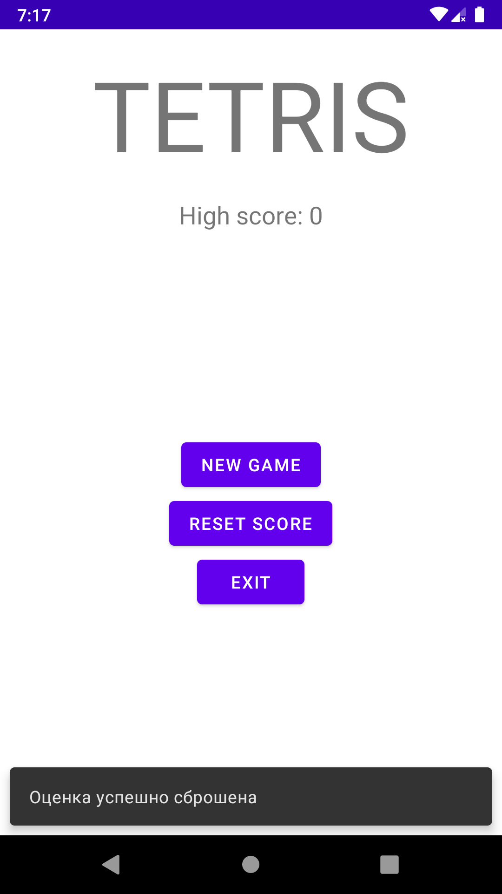
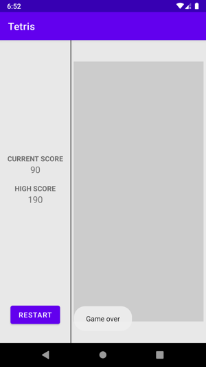
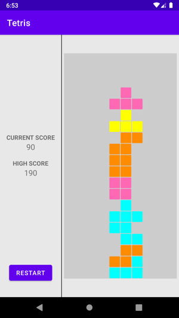
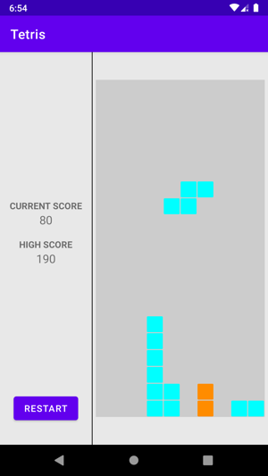

# Tetris

В ходе разработки приложения использовались компоненты View и View groups.

Код упорядочен разделением на модель и представление.

Используеться два Activity. Второе активити вызываеться с помощью намерения(intents)

